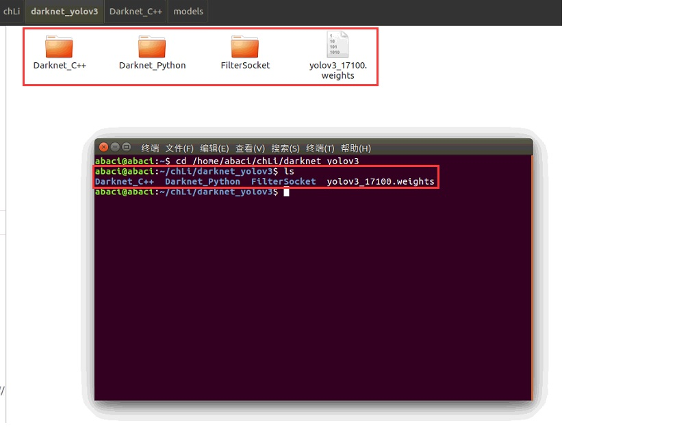
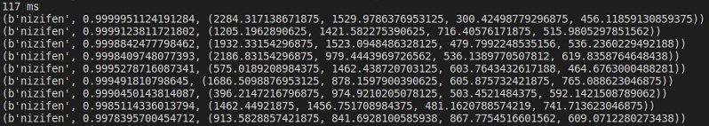
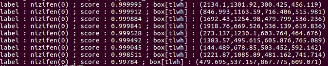
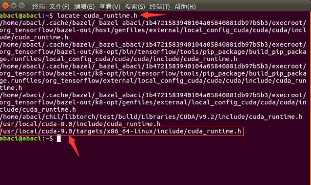
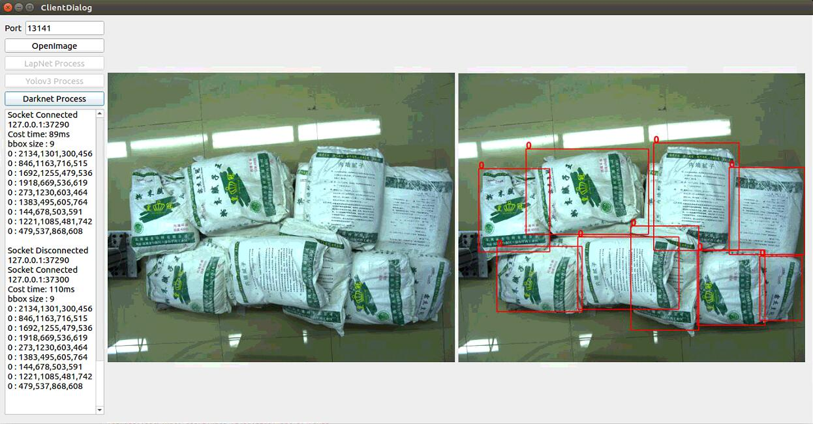

# Darknet Yolov3 推理-接口说明

---

## 0. 开始之前

打开 Terminal ，切换到三个文件夹所在的根目录



运行下述三个指令，将 Yolov3 权重模型分配到每个项目

```cpp
cp models/yolov3_17100.weights Darknet_C++/models

cp models/yolov3_17100.weights Darknet_Python/models

cp models/yolov3_17100.weights FilterSocket/models/yolov3
```

## 1. Python 版本

        通过调用外部 .so 文件使用 darknet 框架

### 1.1 网络加载语句

用于初始化网络，在进行推理期间只需要运行一次

```python
net = load_net((source_path + "../models/yolov3.cfg").encode('utf-8'), (source_path + "../models/yolov3_17100.weights").encode('utf-8'), 0)

meta = load_meta((source_path + "../models/coco.data").encode('utf-8'))
```

### 1.2 网络推理语句

可以重复进行多次推理

```python
r = detect(net, meta, (source_path + "../imgs/01.jpg").encode('utf-8'))
```

### 1.3 推理函数 detect 返回值

默认返回值为包含 **label + score + box** 的元组所组成的数组，如下图所示，本次推理共检测到9个腻子粉目标，对应概率及目标框如下



### 1.4 可能出现的错误

若程序运行没有得到结果，则为某些文件路径出错，需按如下说明进行路径更改

#### 1.4.1 coco.data 中的参数出错

将 Darknet_Python/models/coco.data 中的 names 参数 修改为指向 **Darknet_Python/models/coco.names** 的绝对路径

```python
names = /home/abaci/chLi/darknet_yolov3/Darknet_Python/models/coco.names
```

### 1.5 在其他框架中引用或使用其它模型

#### 1.5.1 修改 lib 变量中指向 libdarknet.so 的路径

将 CDLL 函数中的第一个参数 **source_path + "../include/libdarknet.so"** 修改为指向 **Darknet_Python/include/libdarknet.so** 的绝对路径

```python
lib = CDLL((source_path + "../include/libdarknet.so").encode('utf-8'), RTLD_GLOBAL)
```

#### 1.5.2 修改网络加载参数

将 load_net 函数中的第一个参数 **source_path + "../models/yolov3.cfg"** 修改为你想要使用的 **yolov3.cfg** 的绝对路径

将 load_net 函数中的第二个参数 **source_path + "../models/yolov3_17100.weights"** 修改为你想要使用的 **yolov3.weights** 的绝对路径

```python
net = load_net((source_path + "../models/yolov3.cfg").encode('utf-8'), (source_path + "../models/yolov3_17100.weights").encode('utf-8'), 0)
```

将 load_meta 函数中的参数 **source_path + "../models/coco.data"** 修改为你想要使用的 **coco.data** 的绝对路径

```python
meta = load_meta((source_path + "../models/coco.data").encode('utf-8'))
```

#### 1.5.3 修改推理函数参数

将 detect 函数中的第三个参数 **source_path + "../imgs/01.jpg"** 修改为你想要使用的 **图片** 的绝对路径

```python
r = detect(net, meta, (source_path + "../imgs/01.jpg").encode('utf-8'))
```

## 2. C++ 版本

### 2.1 网络加载语句

用于初始化网络，在进行推理期间只需要运行一次

```cpp
ObjectDetector* darknet_detector = new ObjectDetector(yolov3_cfg, yolov3_weights, coco_cfg);
```

### 2.2 网络推理语句

可以重复进行多次推理

```cpp
std::vector<std::pair<char *, std::vector<float>>> result = darknet_detector->getDarknetResult(img);
```

### 2.3 推理函数 detect 返回值

默认返回值为包含 **(label, score + box + class_num)** 的 pair 所组成的数组，如下图所示，本次推理共检测到9个腻子粉目标，对应概率及目标框如下



### 2.4 可能出现的错误

若程序运行没有得到结果，则为某些文件路径出错，需按如下说明进行路径更改

#### 2.4.1 coco.data 中的参数出错

将 Darknet_C++/models/coco.data 中的 names 参数 修改为指向 **Darknet_C++/models/coco.names** 的绝对路径

```cpp
names = /home/abaci/chLi/darknet_yolov3/Darknet_C++/models/coco.names
```

#### 2.4.2 CUDA 相关出错

若报错与 CUDA 相关，则需要打开 Terminal 运行下面的指令

```cpp
locate cuda_runtime.h
```

得到如下图所示的若干路径，选择当前在使用的CUDA版本对应的 include 文件夹路径



 修改 Darknet_C++.pro 中的路径为上述对应路径

 ```cpp
 unix{
 INCLUDEPATH += /usr/local/cuda-9.0/targets/x86_64-linux/include
 }
 ```


### 2.5 在其他框架中引用或使用其它模型

#### 2.5.1 修改 lib 变量中指向 libdarknet.so 的路径

将下面两个参数修改为分别指向 **darknet.h** , **libdarknet.so** 的绝对路径

```pro
HEADERS += ../include/darknet.h

LIBS += ../include/libdarknet.so
```

#### 2.5.2 修改网络加载参数

将下面三个参数修改为分别指向 **yolov3.cfg** , **yolov3.weights** , **coco.data** 的绝对路径

```cpp
auto yolov3_cfg = "../models/yolov3.cfg";

auto yolov3_weights = "../models/yolov3_17100.weights";

auto coco_cfg = "../models/coco.data";
```

#### 2.5.3 修改推理函数参数

将 load_image_color 函数中的第一个参数 **../imgs/01.jpg** 修改为你想要使用的 **图片** 的绝对路径

```cpp
image img = load_image_color("../imgs/01.jpg", 0, 0);
```

### 2.6 使用数据流作为图片输入

darknet 中图片的存储方式如下

```cpp
typedef struct {
    int w;
    int h;
    int c;
    float *data;
} image;
```

将图片转换为 float* 数据流的方式如下，为了方便表达，我们假定 data 表示一张图片

```cpp
float *image = new float[data.img_height_ * data.img_width_ * data.img_format_];

for(int j=0; j < data.img_height_; j++)
{
        for(int i=0; i < data.img_width_; i++)
        {
                // pixel(i,j)
                int color = data.getRed(i, j);
                if(color < 0)
                {
                        color += 255;
                }
                image[j * data.img_width_ + i] = float(color) / 255.0;
        }
}
for(int j=0; j < data.img_height_; j++)
{
        for(int i=0; i < data.img_width_; i++)
        {
                // pixel(i,j)
                int color = data.getGreen(i, j);
                if(color < 0)
                {
                        color += 255;
                }
                image[data.img_height_ * data.img_width_ + j * data.img_width_ + i] = float(color) / 255.0;
        }
}
for(int j=0; j < data.img_height_; j++)
{
        for(int i=0; i < data.img_width_; i++)
                {
                // pixel(i,j)
                int color = data.getBlue(i, j);
                if(color < 0)
                {
                        color += 255;
                }
                image[2 * data.img_height_ * data.img_width_ + j * data.img_width_ + i] = float(color) / 255.0;
        }
}
```

## 3. Server + Client + Darknet_C++ 版本

### 3.1 Server 端

#### 3.1.1 ObjectDetector 推理类

在 class ObjectDetector 中实现了网络的加载和推理

```cpp
class ObjectDetector
{
private:
        std::vector<std::pair<char *, std::vector<float>>> detect(image im, float thresh=0.5, float hier_thresh=0.5, float nms=0.45);

        std::vector<std::pair<char *, std::vector<float>>> detect(char *img, float thresh=0.5, float hier_thresh=0.5, float nms=0.45);

        std::vector<std::pair<char *, std::vector<float>>> detect(float *img, int w, int h, int c, float thresh=0.5, float hier_thresh=0.5, float nms=0.45);

        network *net;
        metadata meta;

public:
        ObjectDetector(const std::string &yolov3_cfg,
                       const std::string &yolov3_weights,
                       const std::string &coco_cfg);

        std::vector<std::pair<char *, std::vector<float>>> getDarknetResult(image img, float thresh=0.5, float hier_thresh=0.5, float nms=0.45);

        std::vector<std::pair<char *, std::vector<float>>> getDarknetResult(char *img, float thresh=0.5, float hier_thresh=0.5, float nms=0.45);

        std::vector<std::pair<char *, std::vector<float>>> getDarknetResult(float *img, int w, int h, int c, float thresh=0.5, float hier_thresh=0.5, float nms=0.45);
};
```

#### 3.1.2 网络加载语句

在调用构造函数时加载网络参数

```cpp
ObjectDetector(const std::string &yolov3_cfg,
               const std::string &yolov3_weights,
               const std::string &coco_cfg)
{
        const char *c_str_yolov3_cfg = yolov3_cfg.c_str();
        const char *c_str_yolov3_weights = yolov3_weights.c_str();
        const char *c_str_coco_cfg = coco_cfg.c_str();

        char *str_yolov3_cfg = new char[strlen(c_str_yolov3_cfg) + 1];
        char *str_yolov3_weights = new char[strlen(c_str_yolov3_weights) + 1];
        char *str_coco_cfg = new char[strlen(c_str_coco_cfg) + 1];

        strcpy(str_yolov3_cfg, c_str_yolov3_cfg);
        strcpy(str_yolov3_weights, c_str_yolov3_weights);
        strcpy(str_coco_cfg, c_str_coco_cfg);

        net = load_network(str_yolov3_cfg, str_yolov3_weights, 0);

        meta = get_metadata(str_coco_cfg);
}
```

其中关键函数为

```cpp
net = load_network(str_yolov3_cfg, str_yolov3_weights, 0);

meta = get_metadata(str_coco_cfg);
```

分别进行了网络和标签的加载与对应

#### 3.1.3 网络推理语句

在调用推理函数时激活网络进行推理

```cpp
std::vector<std::pair<char *, std::vector<float>>> detect(image im, float thresh=0.5, float hier_thresh=0.5, float nms=0.45)
{
        int num = 0;

        int *pnum = &num;

        network_predict_image(net, im);

        detection *dets = get_network_boxes(net, im.w, im.h, thresh, hier_thresh, nullptr, 0, pnum);

        num = pnum[0];

        if (nms)
        {
                do_nms_obj(dets, num, meta.classes, nms);
        }

        std::vector<std::pair<char *, std::vector<float>>> res;

        for(int j = 0; j < num; ++j)
        {
                for(int i = 0; i < meta.classes; ++i)
                {
                        if(dets[j].prob[i] > 0)
                        {
                                box b = dets[j].bbox;

                                std::pair<char *, std::vector<float>> temp_data;

                                temp_data.first = meta.names[i];

                                temp_data.second.emplace_back(dets[j].prob[i]);
                                temp_data.second.emplace_back(b.x - b.w / 2.0);
                                temp_data.second.emplace_back(b.y - b.h / 2.0);
                                temp_data.second.emplace_back(b.w);
                                temp_data.second.emplace_back(b.h);
                                temp_data.second.emplace_back(i);

                                res.emplace_back(temp_data);
                        }
                }
        }

        for(int i = 0; i < res.size() - 1; ++i)
        {
                for(int j = i + 1; j < res.size(); ++j)
                {
                        if(res[i].second[0] < res[j].second[0])
                        {
                                std::pair<char *, std::vector<float>> exchange_data = res[i];

                                res[i] = res[j];
                                res[j] = exchange_data;
                        }
                }
        }

        free_image(im);

        free_detections(dets, num);

        return res;
}
```

其中关键函数为

```cpp
network_predict_image(net, im);

detection *dets = get_network_boxes(net, im.w, im.h, thresh, hier_thresh, nullptr, 0, pnum);
```

分别进行了网络预测和结果处理。因为 Yolov3 的网络有三个输出层，分别对应大、中、小三个尺度的物体检测结果，并且输出层是按特殊规则定义的，因此结果处理是很有必要的

#### 3.1.4 可能出现的错误

若报错与 CUDA 相关，则需要打开 Terminal 运行下面的指令

```cpp
locate cuda_runtime.h
```

得到如下图所示的若干路径，选择当前在使用的CUDA版本对应的 include 文件夹路径


 修改 Darknet_C++.pro 中的路径为上述对应路径

 ```cpp
 unix{
 INCLUDEPATH += /usr/local/cuda-9.0/targets/x86_64-linux/include
 }
 ```

### 3.2 Client 端

#### 3.2.1 返回数据的绘制和文本显示

在 Client 端的图形界面上将会显示节点、按钮、文本流和图片显示窗格，程序会自动判断当前所处的系统并自动加载和激活所有可用的网络及推理功能，打开图片后点击当前可用的推理按钮，即可在文本流中看到详细信息(若返回BBox信息，则该信息会自动更新到文本流中)，同时图片显示窗格将会一直显示当前打开的原始图片和网络的推理结果



#### 3.2.2 返回数据的处理和使用

在发送完图片以及处理请求之后，该函数用于处理返回的数据

```cpp
void ClientDialog::on_process_finished();
```

其中，变量 res 保存了返回的数据

```cpp
FilterSocket::Connection::ConnectedData &res = socket_->getData();
```

如果返回的是图片，可以使用下面的方式读取

```cpp
QImage img;

res.toQImage(img);
```

如果返回的是矩形框，可以使用下面的方式读取

```cpp
int bbox_num = res.bbox_num_;

std::vector<std::vector<int>> bbox_set;

for(int i = 0; i < bbox_num; ++i>)
{
        std::vector<int> bbox;

        bbox.emplace_back(res.getBBoxLabel(i));

        bbox.emplace_back(res.getBBoxX(i));
        bbox.emplace_back(res.getBBoxY(i));
        bbox.emplace_back(res.getBBoxW(i));
        bbox.emplace_back(res.getBBoxH(i));

        bbox_set.emplace_back(bbox);
}
```

### 3.3 Connection 类

#### 3.3.1 状态变量

class Connection 通过私有变量 is_client_ 来判断当前正在传输的数据的接收者身份，从而决定是否对数据进行处理并将处理结果进行发送

```cpp
private:
    int is_client_{false};
```

class Connection 通过更新当前的 ConnectionState 来判断数据传输所处的状态和阶段

```cpp
enum ConnectionState
{
        State_WaitConnection = 0,
        State_ReadHeader = 1,
        State_ReadData = 2,
        State_Finished = 3,
};
```

class Connection 通过更新当前的 MessageType 来判断当前传输的数据类型及对应结构

```cpp
enum MessageType
{
        Type_Free = 0,
        Type_Image = 1,
        Type_BBox = 2
};
```

class Connection 通过更新当前的 ModelType 来判断 Client 端请求使用哪一个网络

```cpp
enum ModelType
{
        Model_Free = 0,
        Model_LapNet = 1,
        Model_Yolov3 = 2,
        Model_Darknet = 3
};
```

